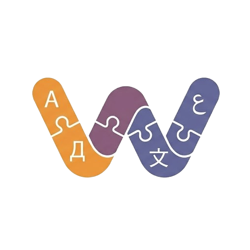

# Wikilangs

[](https://badge.fury.io/py/wikilangs)
[](https://opensource.org/licenses/MIT)
[](https://www.python.org/downloads/release/python-380/)



A Python package for consuming Wikipedia language models including tokenizers, n-gram models, Markov chains, vocabularies, and datasets.

## Features

- **BPE Tokenizers**: Pre-trained tokenizers for 300+ languages and utilities for LLM integration
- **N-gram Models**: Simple language models for text scoring and next token prediction
- **Markov Chains**: Text generation models with configurable depth
- **Vocabularies**: Comprehensive word dictionaries with frequency information
- **Embeddings**: Position-aware cross-lingual word embeddings via [BabelVec](https://github.com/omarkamali/babelvec) designed for resource-constrained environments
- **Datasets**: Wikipedia text data in various splits (1k, 5k, 10k, train) available via [wikisets](https://github.com/wikilangs/wikisets).
- **Multi-language Support**: All models available for 300+ Wikipedia languages
- **Comprehensive Evaluation**: Each language includes complete model evaluations and metrics available at https://huggingface.co/wikilangs/{lang} (e.g., https://huggingface.co/wikilangs/ary, https://huggingface.co/wikilangs/en, https://huggingface.co/wikilangs/fr)
- **Easy API**: Simple, intuitive interface for loading and using models

## Installation

```bash
pip install wikilangs
```

## Quick Start

```python
from wikilangs import tokenizer, ngram, markov, vocabulary, embeddings, languages

# Create a tokenizer (date defaults to 'latest')
tok = tokenizer(lang='en', vocab_size=16000)

# Tokenize text
tokens = tok.tokenize("Hello, world!")
token_ids = tok.encode("Hello, world!")
print(tokens)  # ['_he', 'l', 'lo', ',', '_world', '!']
print(token_ids)  # [1234, 5, 5678, 9, 10, 11]

# Create an n-gram model
ng = ngram(lang='en', gram_size=3)

# Score text
score = ng.score("This is a sample sentence.")
print(score)  # -12.345

# Predict next token
predictions = ng.predict_next("This is a", top_k=5)
print(predictions)  # [('sample', 0.85), ('test', 0.05), ...]

# Create a Markov chain
mc = markov(lang='en', depth=2)

# Generate text
text = mc.generate(length=50)
print(text)  # "Generated text using the Markov chain model..."

# Create a vocabulary
vocab = vocabulary(lang='en')

# Look up a word
word_info = vocab.lookup("example")
print(word_info)  # {'token': 'example', 'frequency': 12345, 'idf_score': 7.91, 'rank': 25436}

# Create embeddings
emb = embeddings(lang='ary', dimension=32)

# Get word vector
vec = emb.embed_word("مرحبا")
print(vec.shape)  # (32,)

# Get sentence vector (supports average, rope, decay, sinusoidal)
sent_vec = emb.embed_sentence("مرحبا بالعالم", method='rope')
print(sent_vec.shape)  # (32,)

# List available languages
available_langs = languages()
print(f"Available languages: {available_langs[:5]}...")
```

## API Reference

### tokenizer(lang, date='latest', vocab_size=16000, format='sentencepiece')

Create a BPE tokenizer instance.

**Parameters:**
- `lang` (str): Language code (e.g., 'en', 'fr', 'ary')
- `date` (str): Date of the model (format: YYYYMMDD, default: 'latest')
- `vocab_size` (int): Vocabulary size (8000, 16000, 32000, 64000)
- `format` (str): Output format ('sentencepiece' or 'huggingface')

**Returns:**
- `BPETokenizer`: Initialized tokenizer instance

### ngram(lang, date='latest', gram_size=3, variant='word')

Create an n-gram model instance.

**Parameters:**
- `lang` (str): Language code (e.g., 'en', 'fr', 'ary')
- `date` (str): Date of the model (format: YYYYMMDD, default: 'latest')
- `gram_size` (int): Size of n-grams (2, 3, 4, 5)
- `variant` (str): Type of n-grams ('word' or 'subword')

**Returns:**
- `NGramModel`: Initialized n-gram model instance

### markov(lang, date='latest', depth=2, variant='word')

Create a Markov chain model instance.

**Parameters:**
- `lang` (str): Language code (e.g., 'en', 'fr', 'ary')
- `date` (str): Date of the model (format: YYYYMMDD, default: 'latest')
- `depth` (int): Depth of the Markov chain (1, 2, 3, 4, 5)
- `variant` (str): Type of transitions ('word' or 'subword')

**Returns:**
- `MarkovChain`: Initialized Markov chain model instance

### vocabulary(lang, date='latest')

Create a vocabulary instance.

**Parameters:**
- `lang` (str): Language code (e.g., 'en', 'fr', 'ary')
- `date` (str): Date of the model (format: YYYYMMDD, default: 'latest')

**Returns:**
- `WikilangsVocabulary`: Initialized vocabulary instance

### embeddings(lang, date='latest', dimension=32)

Create an embeddings instance using BabelVec.

**Parameters:**
- `lang` (str): Language code (e.g., 'en', 'fr', 'ary')
- `date` (str): Date of the model (format: YYYYMMDD, default: 'latest')
- `dimension` (int): Embedding dimension (default: 32)

**Returns:**
- `Embeddings`: Initialized embeddings instance (if `babelvec` is installed)
- `tuple`: `(file_path, metadata)` if `babelvec` is not installed

### languages(date='latest')

List available language codes for a given date.

**Parameters:**
- `date` (str): Date of the dataset (format: YYYYMMDD, default: 'latest')

**Returns:**
- `list[str]`: List of available language codes

### languages_with_metadata(date='latest')

Get available language codes with ISO 639 metadata enrichment.

**Parameters:**
- `date` (str): Date of the dataset (format: YYYYMMDD, default: 'latest')

**Returns:**
- `list[LanguageInfo]`: List of LanguageInfo objects with ISO 639 metadata (name, alpha_2, alpha_3, etc.)

## Available Languages

Models are available for 300+ Wikipedia languages including:

- English (`en`)
- French (`fr`)
- Spanish (`es`)
- German (`de`)
- Arabic (`ar`)
- Chinese (`zh`)
- Japanese (`ja`)
- Korean (`ko`)
- And many more...

## Available Dates

Models are updated regularly. Check the [Hugging Face organization](https://huggingface.co/wikilangs) for the latest available dates.

## Embeddings

For advanced embedding operations, install BabelVec:

```bash
pip install babelvec
```

Using the `wikilangs` API:

```python
from wikilangs import embeddings

# Load embeddings (defaults to 32 dimensions)
emb = embeddings(lang='ary')

# Get word vector
vec = emb.embed_word("مرحبا")

# Position-aware sentence embedding (supports 'average', 'rope', 'decay', 'sinusoidal')
sent_vec = emb.embed_sentence("مرحبا بالعالم", method='rope')
```

Or using `BabelVec` directly:

```python
from huggingface_hub import hf_hub_download
from babelvec import BabelVec

# Load embeddings
embedding_file = hf_hub_download(
    repo_id='wikilangs/ary',
    filename='models/embeddings/monolingual/ary_32d.bin',
    repo_type='model'
)
model = BabelVec.load(embedding_file)
```

## Examples

Check out the demo scripts:
- `demo_models.py` - Basic model operations
- `demo_embeddings.py` - Embedding operations with BabelVec
- `demo_comprehensive.py` - All models working together

## Development

### Install dependencies

```bash
pip install -r requirements.txt
```

### Run tests

```bash
pytest tests/
```

## Acknowledgments

We are deeply grateful to our generous sponsor [Featherless.ai](https://featherless.ai) for making this project possible.

Created and maintained by [Omar Kamali](https://github.com/omarkamali) from [Omneity Labs](https://omneitylabs.com).

Wikilangs is built on top of the incredible work by the Wikimedia Foundation and the open-source community. All content maintains the original CC-BY-SA-4.0 license.

## License

MIT License - see [LICENSE](LICENSE) for details.

## Citation

If you use this package in your research, please cite:

```bibtex
@misc{wikilangs2025,
  title = {Wikilangs: Open NLP Models for Wikipedia Languages},
  author = {Kamali, Omar},
  year = {2025},
  publisher = {HuggingFace},
  url = {https://huggingface.co/wikilangs},
  institution = {Omneity Labs}
}
```
